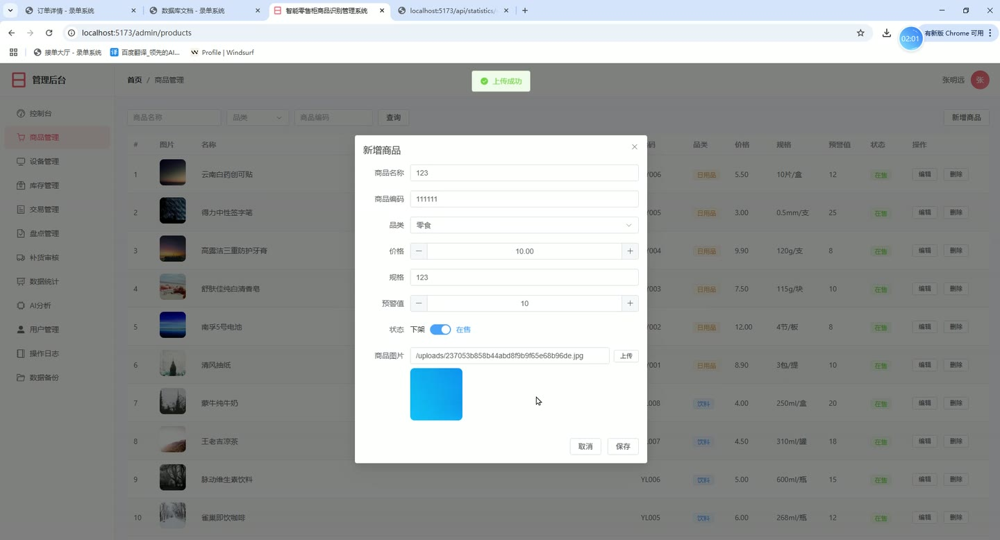
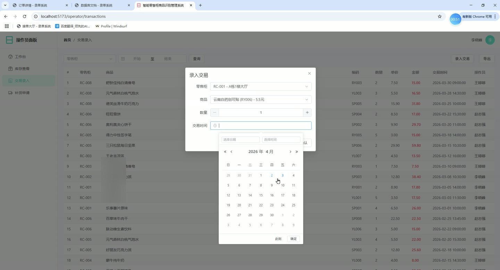
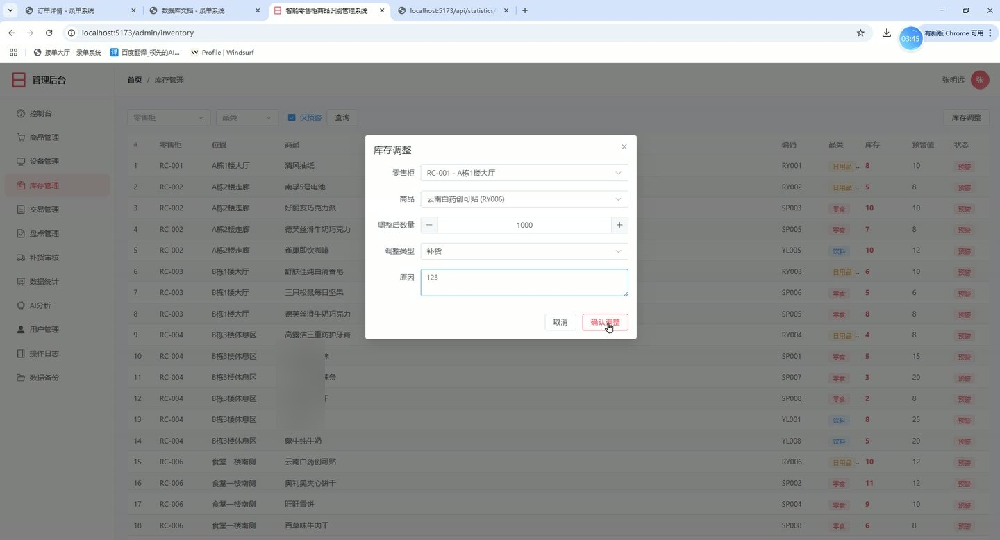
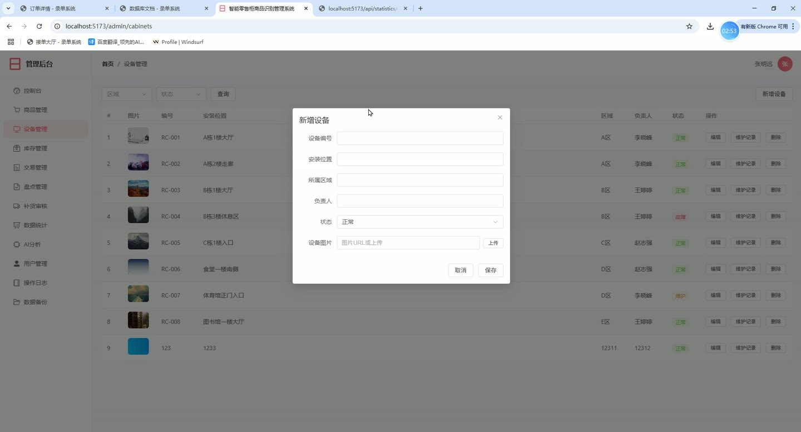
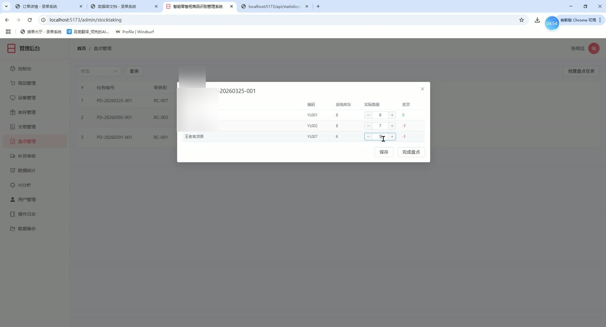
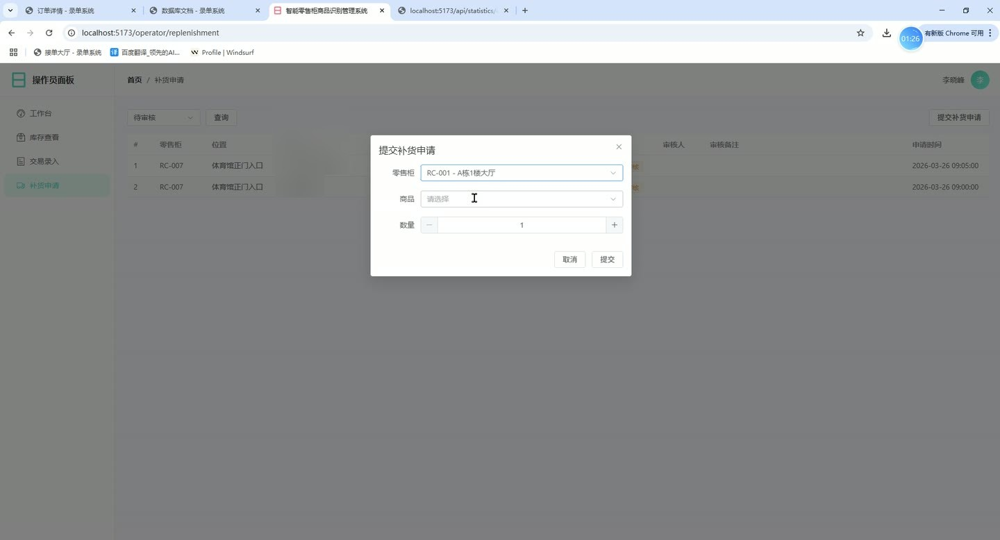

# (附文档)Python+Flask+Vue3 智能零售柜商品识别管理系统

**技术栈**：Python、Flask、Vue3、MySQL

### 系统简介

本系统是一套面向智能零售柜场景的商品识别与运营管理平台，采用前后端分离架构，后端基于 Python Flask 提供 RESTful 接口，前端基于 Vue3 构建管理界面。系统包含管理员端与操作员端两类角色，覆盖商品档案、零售柜设备、库存监控、交易流水、盘点任务、智能补货、AI 库存分析与数据备份等业务环节，并内置操作日志审计能力。
 
### 核心功能
 
### 管理员端

 
- 数据看板：展示商品总数、零售柜总数、设备正常率、库存预警数、待审补货数与累计交易额六项核心指标。 
- 库存预警面板：按商品展示当前库存与预警阈值对比条，低于阈值 30% 时以红色高亮提示。 
- 近期交易速览：在首页直接查看最近的交易记录，包含零售柜、商品、数量、金额与交易时间。 
- 商品管理：新增、编辑、删除商品，维护商品名称、编码、品类、价格、规格、预警阈值、在售状态与商品图片。 
- 商品检索：支持按商品名称、品类、商品编码组合筛选查询。 
- 商品图片上传：通过上传接口提交图片文件，成功后自动回填图片地址并支持预览。 
- 零售柜管理：新增、编辑、删除零售柜设备，维护设备编号、安装位置、所属区域、负责人、状态与设备图片。 
- 设备检索：支持按所属区域与设备状态筛选零售柜列表，区域下拉项由接口动态返回。 
- 设备状态标记：可将设备状态设置为正常、故障或维护，并以不同颜色标签区分展示。 
- 维护记录管理：查看指定零售柜的历史维护记录，包含维修时间、故障原因、维修人员与维修结果。 
- 新增维护记录：为指定设备补录维护信息，记录故障原因与维修结果。 
- 库存查询：按零售柜、品类筛选库存明细，可勾选“仅预警”只查看低于阈值的库存记录。 
- 库存状态标识：库存数量低于预警阈值时以红色加粗显示，并标注为预警状态。 
- 库存调整：选择零售柜与商品，填写调整后数量、调整类型与原因，提交后更新库存。 
- 调整类型区分：支持补货、盘点、损耗三种调整类型，分别以不同标签颜色展示。 
- 库存调整记录：查看调整历史，包含调整前数量、调整后数量、变化量、操作人与原因。 
- 交易管理：录入交易记录，选择零售柜、商品、数量与交易时间，系统按商品单价自动计算金额。 
- 交易查询：支持按零售柜与日期区间筛选交易流水。 
- 交易汇总：按零售柜统计交易总额与交易笔数，以汇总卡片形式展示。 
- 盘点任务创建：选择零售柜生成盘点任务，系统自动生成任务编号并载入该柜商品清单。 
- 盘点录入：逐条填写商品实际数量，系统实时计算与系统库存的差异值并以颜色区分正负。 
- 盘点状态流转：任务状态支持待盘点、盘点中、已完成，可保存草稿或直接完成盘点。 
- 补货审核：查看待审核补货申请，包含零售柜、位置、商品、申请数量、申请人与申请时间。 
- 补货审批操作：对待审申请执行通过或拒绝，拒绝时需填写拒绝原因，审核人与备注自动记录。 
- 补货完成标记：对已通过的补货申请标记为已完成，形成完整审批闭环。 
- 交易统计：按日、周、月切换统计周期，查看销量排行 TOP10、交易额趋势、品类销售占比与各柜交易额。 
- 库存统计：查看库存品类分布与库存变化趋势，趋势图区分补货量与损耗量。 
- 报表导出：支持导出交易报表与库存报表。 
- AI 库存分析：按零售柜维度发起智能分析，输出销量排行、品类月度销售趋势、库存健康度与库存预警明细。 
- 智能补货建议：根据分析结果输出紧急、预警、建议三级提示，并给出建议补货数量。 
- 用户管理：新增、编辑用户，维护用户名、角色、姓名与电话，角色分为管理员与操作员。 
- 用户状态控制：一键启用或禁用账号，禁用后无法登录系统。 
- 密码重置：将指定用户密码重置为默认值，操作后立即生效。 
- 操作日志查询：按操作人、操作类型与日期区间筛选日志，查看操作内容、IP 地址与操作时间。 
- 日志类型字典：操作类型下拉项由接口动态返回，保证筛选条件与后端一致。 
- 过期日志清理：一键清理三个月前的历史日志，释放存储空间。 
- 数据备份：一键创建数据库备份，记录备份名称、文件大小、操作人与备份时间。 
- 数据恢复：选择历史备份执行恢复，恢复完成后强制退出登录以重新鉴权。
 
### 操作员端

 
- 操作员工作台：登录后进入独立布局，展示操作员维度的业务概览数据。 
- 库存查看：查看所辖零售柜的商品库存情况，掌握当前库存数量与预警状态。 
- 交易查看：查询交易流水，了解商品销售数量、单价与金额明细。 
- 补货申请：针对库存不足的商品提交补货申请，填写零售柜、商品与申请数量。 
- 补货进度跟踪：查看本人提交的补货申请状态，包括待审核、已通过、已拒绝与已完成。 
- 权限隔离：操作员账号仅可访问操作员端路由，访问管理员页面时被自动重定向至操作员工作台。
 
### 技术栈

 后端框架Python + Flask 认证鉴权Flask-JWT-Extended，基于 JWT 令牌鉴权，支持令牌有效期配置 跨域处理Flask-CORS，支持携带凭证的跨域请求 路由组织Flask Blueprint 蓝图分模块注册，涵盖认证、用户、商品、设备、库存、交易、盘点、统计、日志、AI 分析、上传、备份、补货 前端框架Vue3（组合式 API + script setup） 前端路由Vue Router，采用懒加载与全局前置守卫实现登录校验与角色路由拦截 状态管理Pinia 用户状态仓库，配合 localStorage 持久化令牌与用户信息 UI 组件库Element Plus，含表格、表单、对话框、日期选择器、上传等组件 图表可视化ECharts，用于柱状图、折线图、饼图渲染 构建工具Vite，前端构建产物由 Flask 静态目录统一托管 数据库MySQL 文件上传Flask 上传目录配置，单文件请求体上限 16MB
 
### 交付内容

 
- 后端完整源码 
- 前端完整源码 
- 数据库初始化脚本 
- 万字文档

## 界面展示

---

## 获取完整源码 + 万字文档

本仓库为项目介绍页。**完整前后端源码、数据库初始化脚本、万字项目文档**，请加微信 `kangkangcode`，或访问 [codekk.top](http://codekk.top) 获取。

可作课程设计 / 毕业设计参考，支持远程部署调试。